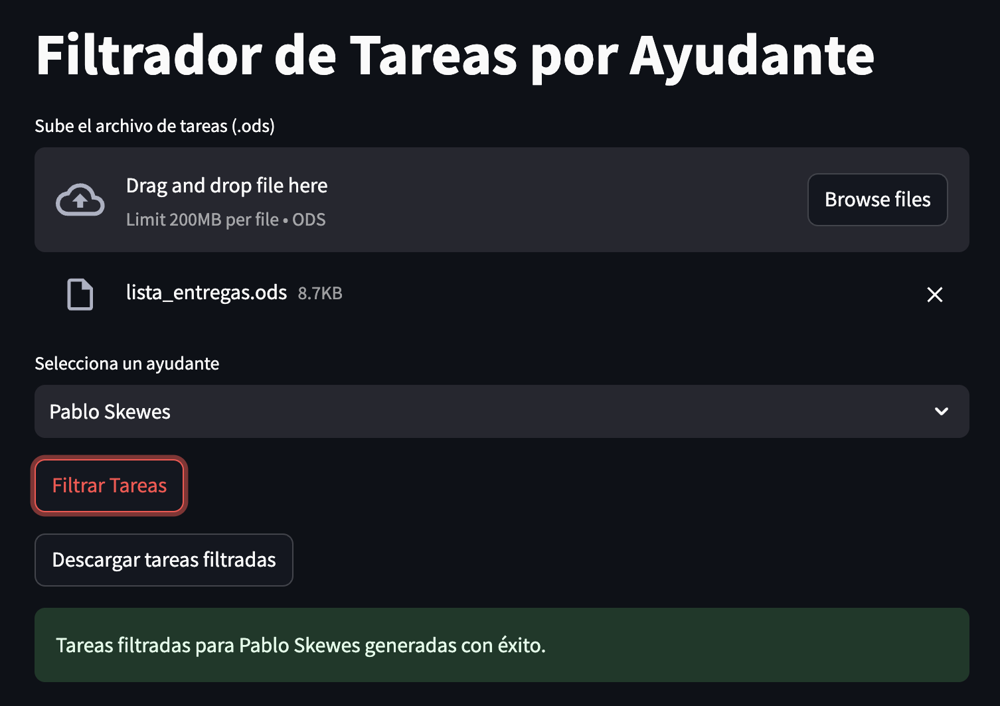

# Filtrador de Tareas

Este proyecto tiene como objetivo filtrar las tareas de estudiantes por ayudante desde un archivo de entrada y guardar los resultados en un archivo de salida. Está diseñado para manejar archivos en formato `.ods` y exportar los resultados filtrados a un archivo `.xlsx`. El archivo de entreda es el que se descarga directamente desde U-Cursos.

## Requisitos

- Python 3.11 o más.
- `odfpy` para manejar archivos `.ods`
- `pandas` para manipulación de datos
- `openpyxl` para guardar los resultados en formato `.xlsx`
- `streamlit` para usar la interfaz gráfica

## Instalación

1. Clonar el repositorio:

```bash
git clone <URL_DEL_REPOSITORIO>
cd filtrador-tareas
```

2. Crear y activar un entorno virtual:

```bash
python -m venv venv
source venv/bin/activate  # En Linux/MacOS
.\venv\Scripts\activate   # En Windows
```

3. Instalar las dependencias:

```bash
pip install -r requirements.txt
```

## Uso

Para filtrar las tareas de un ayudante específico, ejecuta el siguiente comando desde la raíz del proyecto:

```bash
python -m filtrador_tareas.cli --ayudante "NOMBRE_DEL_AYUDANTE" --input data/lista_entregas.ods --output data/tareas_<ayudante>.xlsx
```

### Ejemplo:

```bash
python -m filtrador_tareas.cli --ayudante "Pablo Skewes" --input data/lista_entregas.ods --output data/tareas_pablo_skewes.xlsx
```

Este comando filtra las tareas de "Pablo Skewes" y guarda los resultados en `data/tareas_pablo_skewes.xlsx`.

## Interfaz gráfica

El programa también se puede correr usando una interfaz gráfica de la siguiente manera:

```bash
streamlit run app.py
```

Esto abrirá la app en `http://localhost:8501/`. En esta se puede subir el archivo `.ods`, seleccionar al ayudante y luego apretar el botón para ejecutar el programa. Una vez listo, se puede descargar el resultado en formato `.xsls`.



## Contribuciones

Las contribuciones son bienvenidas. Por favor, abre un issue o pull request para discutir los cambios propuestos.
